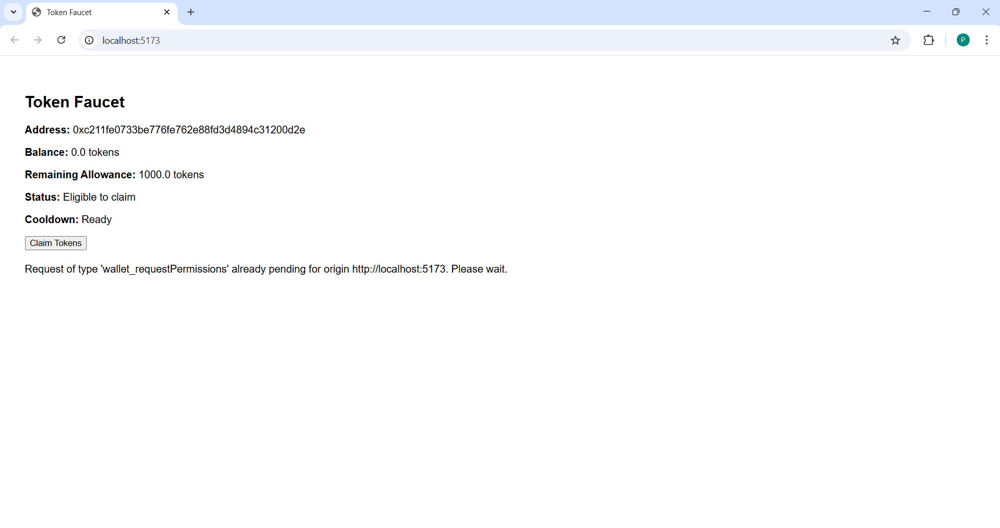
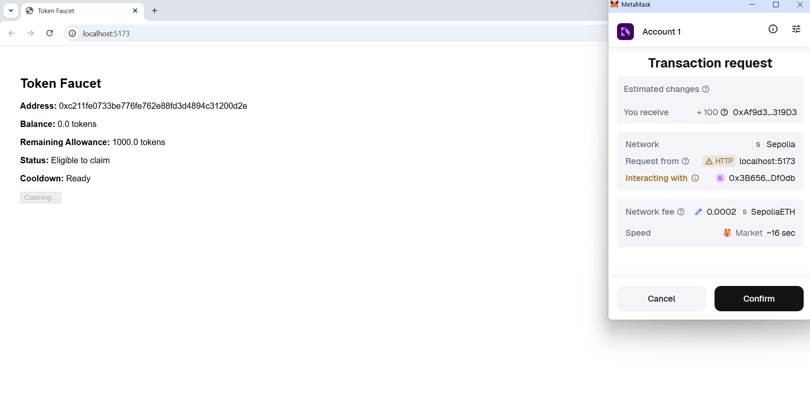
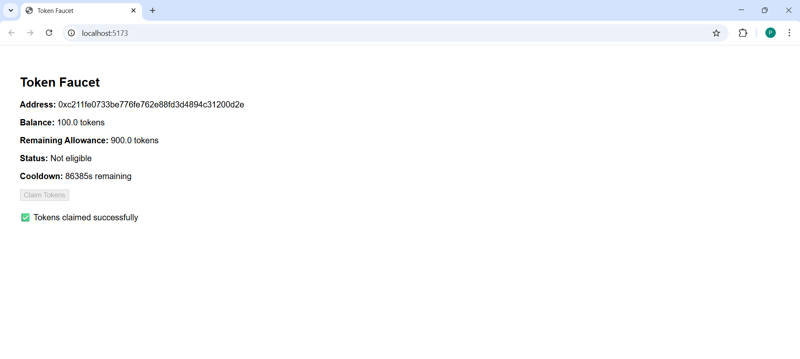

# Token Faucet DApp

A full-stack *Ethereum Token Faucet DApp* deployed on the *Sepolia test network*.  
Users can claim ERC-20 tokens through a secure faucet with cooldowns and lifetime limits to prevent abuse.

---

## Project Overview

This project demonstrates a real-world Web3 application that includes:

- Smart contract design  
- Frontend–blockchain integration  
- Automated testing  
- Dockerized deployment  

Users connect their wallet using MetaMask and claim tokens while the system enforces fairness and security rules.

---

## Architecture

### Smart Contracts

#### YourToken.sol
- ERC-20 compliant token  
- Minting restricted to the faucet  

#### TokenFaucet.sol
- Distributes tokens  
- Enforces:
  - 24-hour cooldown between claims  
  - Lifetime claim limit per address  
  - Admin pause/unpause  
- Emits events on successful claims  

---

### Frontend

- Built with *React + Vite*
- Uses *ethers.js*
- Wallet connection via *MetaMask*
- Displays:
  - Wallet address  
  - Token balance  
  - Claim eligibility  
  - Cooldown timer  
  - Remaining allowance  

---

### Deployment

- Dockerized using *Node + Express*
- Exposes /health endpoint
- Runs on *port 3000*

---

## Deployed Contracts (Sepolia)

- **Token Contract:**  
  `0xAf9d37E6fF71AEbD1e2b55100BbBDBc87ae319D3`  
  https://sepolia.etherscan.io/address/0xAf9d37E6fF71AEbD1e2b55100BbBDBc87ae319D3

- **Faucet Contract:**  
  `0x28D15C6CA92e5731A81b9feD0E0D980744a0e73d`  
  https://sepolia.etherscan.io/address/0x3B6568F02793fA03D04feeE5da7053C66f7Df0db

---

## Environment Configuration

Create a .env file inside frontend/:

env:
VITE_RPC_URL=https://sepolia.infura.io/v3/6fe24a78c70d4082b8fb53cb5230dc68
VITE_TOKEN_ADDRESS=0xAf9d37E6fF71AEbD1e2b55100BbBDBc87ae319D3
VITE_FAUCET_ADDRESS=0x3B6568F02793fA03D04feeE5da7053C66f7Df0db

**Running the Application**
Frontend:
```
cd frontend
npm install
npm run dev
``` 

Smart Contracts:

```
npx hardhat compile
npx hardhat test
npx hardhat run scripts/deploy.js --network sepolia
```

## Screenshots (Working Application Proof)

### Wallet Connection & Claim Eligibility


---

### Transaction Confirmation Flow


---

### Successful Claim & Cooldown Enforcement


Notes

Cooldown and lifetime limits are enforced at the smart contract level.

UI reflects eligibility and cooldown error states clearly.

Transactions are confirmed via MetaMask before execution.

License

MIT